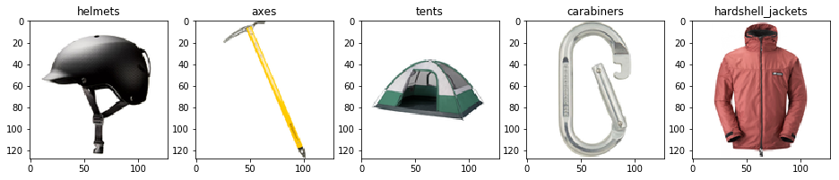

# Challenge 2:  Deep in the Woods

## Background

Your data science team wants to use *deep learning* techniques to build an image classification model that can identify each class of product the company sells. Specifically, the team wants to develop a *convolutional neural network* (CNN) model. You can use your choice of deep learning framework from *PyTorch* or *Keras*.

### PyToch vs Keras

Keras is an abstraction over either TensorFlow or Theano, and caffe, both deep learning frameworks. Keras makes it easy to define neural networks in a very readable way. All code is tested against TensorFlow but should also work with Theano.  One of Keras` top sponsors is Google.  

* Keras is more established.  commonly used.  genereally used on top of tensorflow.  more like traditional data scientist would use with vectors and matrices.  
  * keras is *slightly* easier to use (IMO)
* pytorch
  * Created and backed by Facebook and MSFT 
  * more like traditional programming (classes, functions)
  * port of the popular Torch framework where the binaries are wrapped in GPU accelerated python

both are fundamentally the same and if you are brand-new it doesn't really matter.

**Both *should* work for this hack, but I am more comfortable with pyTorch and have tested it a bit better.**

## Prerequisites

* The resized  ***gear*** image data fom the previous challenges.

## Challenge

There are three tasks in this challenge:

1. Explore a sample convolutional neural network model.
2. Create and train a convolutional neural network (CNN) model.
3. Use your model with new data.

### 1. Explore a sample convolutional neural network model

Explore the notes and code in the **02-Image Classification (*framework*).ipynb** notebook in the **/notebooks** folder to see an example of building and using a CNN.

#### Hints

* When you generate the `shapes` you can view them quickly right in jupyterhub by navigating to `notebooks/shapes` then clicking through a few 
* You may see some errors when installing libraries.  Simply rerun the cell and see if that solves the issue.  These packages are constantly changing and I've done my best to ensure they are totally rerunnable, but they aren't.  

### 2. Create and train a convolutional neural network (CNN) model

In a a new notebook, create a CNN that predicts the class of an image based on the resized *gear* images you created in the previous challenge.

* The architecture of your model should consist of a series of *convolutional*, *pooling*, *drop*, and *fully-connected* layers that you define.
* The input layer of your model must match the size and shape of the training image arrays.
* The output layer of your model must include an output for each class the model is designed to predict.
* Randomly split the data into training and validation subsets with which to train and validate the model.
* For each epoch in your training process, you should record the average *loss* for both the training and validation data; and when training is complete you should plot the training and loss values like this:

    

#### Hints

* Use the **Python 3.5** kernel 
* Steal the code from the sample notebook you just ran.  But make Base your initial solution on the code in the sample notebook.
* To improve the model's performance, try adding more convolutional and pool layers, or using more training epochs.
* Try to avoid *overfitting* your model to the training data. One sign of this is that after your training and validation loss metrics converge, the training loss continues to drop but your validation loss stays the same or rises (as shown in the image above). The end result is a model that performs well when predicting the classes of images that it has been trained on, but which does not generalize well to new images.
* Techniques to help avoid overfitting include:
  * Including *drop* layers to randomly remove some features from the model.
  * Augmenting the data with re-oriented, skewed, or otherwise altered versions of training images.
    * try "rotating" your images a bit

### 3. Use your model with new data

Use the model to predict the class of at least five relevant images that are not included in the ***gear*** dataset. You can find these images by using Bing to search for appropriate terms, for example:

* <a href="https://www.bing.com/images/search?q=ski+helmet" target="_blank">https://www.bing.com/images/search?q=ski+helmet</a>
* <a href="https://www.bing.com/images/search?q=climbing+axe" target="_blank">https://www.bing.com/images/search?q=climbing+axe</a>
* <a href="https://www.bing.com/images/search?q=tent" target="_blank">https://www.bing.com/images/search?q=tent</a>
* <a href="https://www.bing.com/images/search?q=carabiner" target="_blank">https://www.bing.com/images/search?q=carabiner</a>
* <a href="https://www.bing.com/images/search?q=insulated+jacket" target="_blank">https://www.bing.com/images/search?q=insulated+jacket</a>

#### Hints

* You can download the new images to your DSVM by using the `curl` command.
* You should resize and pre-process the new images to match the images with which the model was trained.

## Success Criteria

* Successfully train a convolutional neural network model
* Plot the average training and validation loss observed when training your model
* Achieve model accuracy of **0.90** (90%) or greater using your test data set.
* Show predictions for the five images you identified in the **Challenge** section, like this:

  

  *(Note: Your model is not required to predict the correct class for all of the images, but it would be good if it does!)*

When your coach has verified your team's solution, you can proceed to the [next challenge](Challenge03.md).

## References

### CNN Concepts

* <a href="https://ujjwalkarn.me/2016/08/11/intuitive-explanation-convnets/" target="_blank">An Intuitive Explanation of Convolutional Neural Networks</a>
* <a href="https://www.youtube.com/watch?v=FmpDIaiMIeA" target="_blank">How Convolutional Neural Networks work</a> (video)
* <a href="https://youtu.be/k-K3g4FKS_c" target="_blank">Demystifying AI</a> (video)

### Deep Learning Frameworks

* **<a href="https://pytorch.org/" target="_blank">PyTorch</a>**
  * <a href="https://pytorch.org/docs/stable/index.html" target="_blank">Documentation</a>
  * <a href="https://pytorch.org/tutorials/" target="_blank">Tutorials</a>
* **<a href="https://keras.io/" target="_blank">Keras</a>** (an abstraction layer that uses a TensorFlow or CNTK backend)
  * <a href="https://keras.io/" target="_blank">Documentation</a>
  * <a href="https://github.com/fchollet/keras-resources" target="_blank">Tutorials</a>
