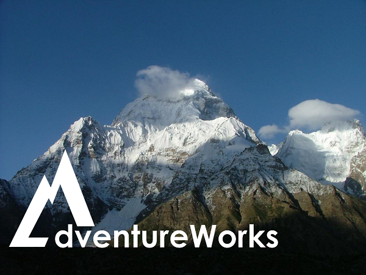

**try adding the following to the next version of this class**:

*  https://blog.revolutionanalytics.com/2019/01/notebooks-from-the-practical-ai-workshop.html  (see video)
  *  notebooks are cloned to notebooks.azure.com personal account

# WORKSHOP: Deep Learning, AI, and ML: A Hands-on Hack

https://www.microsoftevents.com/profile/6549225

Have you read about Deep Learning but don't understand it? Did you ever wonder how computer vision AI really works under-the-covers? Wondering how AI can transform your business? In this "hackfest" we will look at a real computer vision use case for a REAL company. Then we'll break apart the solution and show you how to develop it, even if you are NOT a developer. Scattered throughout the day we'll learn the theory behind the implementation and show you how to develop DevOps pipelines to deploy the solution. Whether you are a seasoned data scientist, a developer wanting to learn new skills, or a business person that has never touched a Jupyter notebook but wants to see the Art of the Possible, this session is for you!

Audience: Data Architects, Data Scientists, CTO

**IMPORTANT!!** – If you are attending a hands-on WORKSHOP, a laptop and an active Azure subscription are required in order to work through the labs. You will want to make sure you have the appropriate set of rights in that subscription to instantiate the services that you will be working with. If you have any questions about these requirements, please reach out to your Microsoft contact.

## Ancillary Content

[Presentation](OpenHack-DeepLearning.pptx)  
[ML Primers](MLIntros/README.md) :  these notebooks are good for basic ML and AI work.  If you are stuck doing this hack then consider doing these instead.  

## Helpful Hints

* If you don't understand something, just ask
* This is fairly advanced stuff.  If you get lost, just ask.  Don't get frustrated.  We attempt to do in 1 day what may take a team *months* to do.  
* Need an Azure Subscription?  [Here are the steps](provision.md).  

## Scenario

Adventure Works, a major outdoor and climbing gear retailer, wants to understand customer behavior by learning more about the gear that consumers purchase.  

Your team has been invited to work with Adventure Works and build a computer vision solution based on the image data they have collected.

## Challenges

The hack will begin with a short presentation to set the context and explain fundamental concepts. You will have some time after the presentation to review the resources provided and create your own solution for each challenge.

* [Challenge 1: Establishing Base Camp](Challenge01.md)
* [Challenge 2: Deep in the Woods](Challenge02.md)
* [Challenge 3: A Run in the Clouds](Challenge03.md)
* [If Time permits, Challenge 4: Following the Marked Trail](Challenge04.md)

Each challenge covers a different aspect of machine learning for computer vision, and all of them will require you to write Python code. You can reference the <a href="https://docs.python.org/3.6/" target="_blank">Python 3.6 documentation</a> for help.

[Instructor Notes](InstructorNotes.md)
